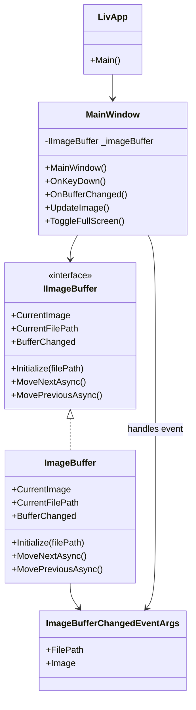

# Lightweight Image Viewer (liv) - Implementation Overview

## Project Structure

```
liv/
??? LivApp.cs           # Application entry point
??? MainWindow.cs       # Main image viewer window
??? Services/
?   ??? IImageBuffer.cs             # Buffer interface
?   ??? ImageBuffer.cs              # Buffer implementation
?   ??? ImageBufferChangedEventArgs.cs # Buffer event args
??? liv.csproj          # Project file
```

## Main Components

### 1. LivApp (LivApp.cs)
- **Purpose:** Application entry point.
- **Details:** Initializes the application and launches the main window.

### 2. MainWindow (MainWindow.cs)
- **Purpose:** Main Windows Forms window for image viewing.
- **Details:**
  - Handles user input (keyboard navigation, fullscreen toggle).
  - Displays images using a `PictureBox`.
  - Interacts with the image buffer to load and display images.
  - Manages window state and resizing.

### 3. IImageBuffer (Services/IImageBuffer.cs)
- **Purpose:** Interface for image buffering logic.
- **Details:** Defines methods for initializing, navigating, and events for buffer changes.

### 4. ImageBuffer (Services/ImageBuffer.cs)
- **Purpose:** Implements image buffering and navigation.
- **Details:**
  - Loads images from the current folder.
  - Buffers a configurable number of previous/next images for fast navigation.
  - Handles circular navigation (wraps around at folder boundaries).
  - Raises events when the current image changes.

### 5. ImageBufferChangedEventArgs (Services/ImageBufferChangedEventArgs.cs)
- **Purpose:** Event arguments for buffer change notifications.
- **Details:** Contains the file path and image object for the new image.

---

## Class Interaction Diagram (Mermaid)



---

## Interaction Flow

1. **Startup:**  
   `LivApp.Main()` initializes the application and opens `MainWindow`.

2. **Image Loading:**  
   `MainWindow` creates an `ImageBuffer` and initializes it with the selected image file.

3. **Navigation:**  
   User presses left/right arrow keys.  
   `MainWindow` calls `MoveNextAsync()` or `MovePreviousAsync()` on the buffer.

4. **Buffer Update:**  
   `ImageBuffer` loads the next/previous image, updates its buffer, and raises the `BufferChanged` event.

5. **Image Display:**  
   `MainWindow` handles the `BufferChanged` event and updates the `PictureBox` with the new image.

6. **Fullscreen:**  
   User presses F11.  
   `MainWindow` toggles fullscreen mode.

---

## Notes

- **Buffering:** The buffer preloads images for instant navigation.
- **Circular Navigation:** Moving past the last image wraps to the first, and vice versa.
- **Separation of Concerns:** UI logic is separated from image loading/buffering logic via interfaces and events.
- **Unit Tests:** Core buffer logic is covered by unit tests for navigation and circular behavior.

---

If you need more details or want to see a specific diagram or code snippet, let me know!
